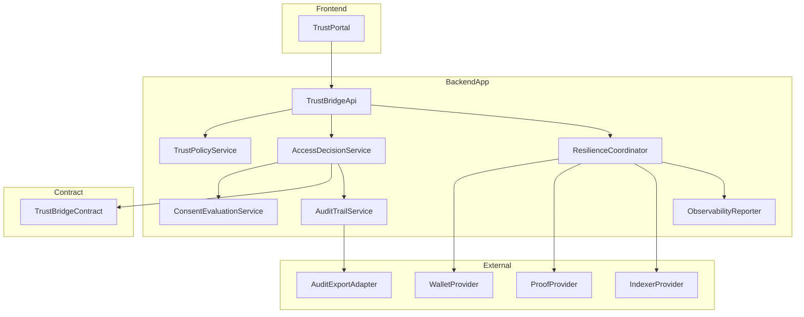
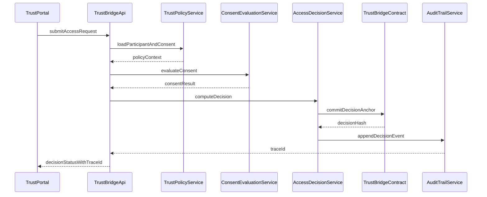
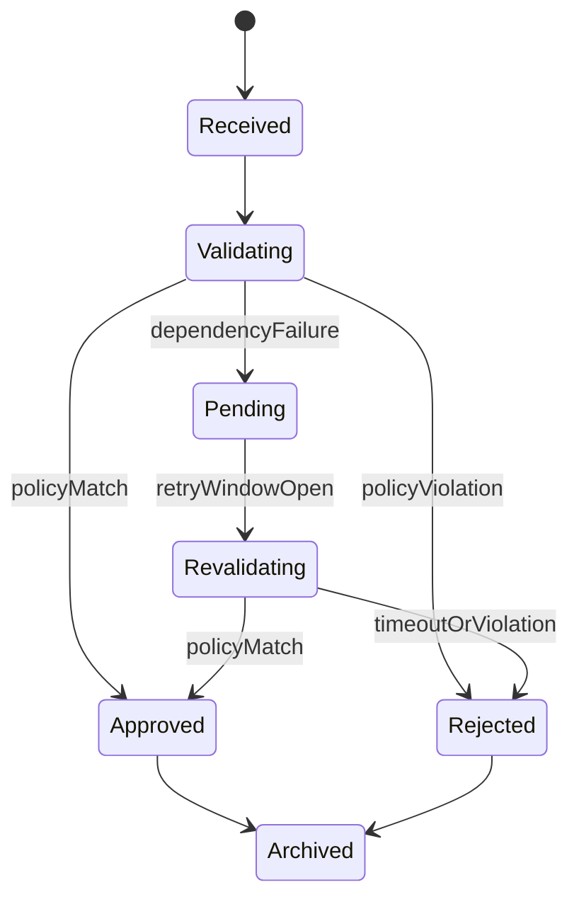
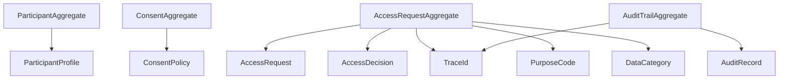
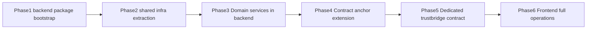

# Design Document

## Overview

NextMed TrustBridge は、医療データ連携の可否判定を「参加者信頼」「患者同意」「要求妥当性」「監査可能性」で統合管理する。既存リポジトリには Midnight の `counter` サンプルを中心とした契約・CLI・テスト導線が存在するため、本設計はその運用基盤を活かしつつ、医療連携ドメインを独立した境界として追加する。

本機能の対象ユーザーは、連携運用管理者、患者または代理権限者、連携先システム、監査責任者、運用担当者である。判定不能時には安全側（不承認または保留）に倒すことを既定とし、追跡IDを軸に判定・通知・監査・復旧を一貫追跡できる構成へ変更する。

### Goals

- 参加者管理、同意管理、連携判定、監査、運用可観測性を一貫した設計境界で定義する。
- 既存 `contract` / `cli` / `frontend` パッケージ責務を維持したまま拡張する。
- 要件 `1.1`〜`5.5` を型安全な契約（Service/API/Event/State）に落とし込む。

### Non-Goals

- 医療標準（FHIR）完全準拠の実装詳細定義。
- 既存 `counter` 機能の削除や全面リプレイス。
- 本フェーズでの本番運用パラメータ確定（SLA 閾値、監査連携最終形式など）。

## Architecture

### Existing Architecture Analysis (if applicable)

- 既存契約は `counter.compact` の単一状態遷移のみで、業務ドメイン境界が未定義。
- `cli` は wallet/proof/indexer 接続、デプロイ、呼び出し、ログ出力の実行基盤を提供。
- `frontend` はテンプレート状態で、業務UIの責務をまだ持たない。
- 既存構成に常駐HTTP API層は存在しないため、`frontend` 連携の安定化には API 実行境界の新設が必要。
- 既存構成は「パッケージ境界を明確化する」steering 方針と整合しているため、同方針を維持して拡張する。

### Architecture Pattern & Boundary Map

**Architecture Integration**

- Selected pattern: Hexagonal + Layered Hybrid
- Domain boundaries:
  - `TrustPolicy`（参加者・同意）
  - `AccessDecision`（要求判定）
  - `AuditTrail`（監査・証跡）
  - `OpsObservability`（障害・再試行・メトリクス）
- Existing patterns preserved:
  - `contract` が状態遷移責務を保持
  - `cli` が外部接続と運用手順を保持
  - `frontend` が表示/操作層を保持
- New components rationale:
  - 判定ロジック、監査管理、通知連携を分離し、責務肥大化を回避
- Steering compliance:
  - 境界越えは公開API経由、環境依存値は設定注入、障害前提の設計を維持



### Technology Stack & Alignment

| Layer | Choice / Version | Role in Feature | Notes |
| --- | --- | --- | --- |
| Frontend / UI | React 19.2, Vite 7.3 | 参加者・同意・判定・監査画面 | 既存 `frontend` を業務UIへ拡張 |
| Backend / API | TypeScript 5.9 ESM, Node.js | 常駐HTTP API とドメインサービス実行境界 | 新規 `pkgs/backend` を追加し API 境界を固定 |
| Operational CLI | TypeScript 5.9 ESM, Node.js | 運用コマンド（デプロイ/検証/保守） | 既存 `pkgs/cli` は運用用途に特化 |
| Shared Infrastructure | TypeScript 5.9 ESM (`pkgs/shared-infra`) | provider 設定、接続ユーティリティ、共通型 | `backend` と `cli` の共通依存点を集約 |
| Contract Runtime | Compact language, `@midnight-ntwrk/compact-runtime` 0.9 | 判定根拠ハッシュと重要状態の不変管理 | 初期は最小オンチェーン責務 |
| Wallet / Chain SDK | `@midnight-ntwrk/wallet` 5.0, `@midnight-ntwrk/wallet-api` 5.0, `@midnight-ntwrk/midnight-js-*` 2.0.2 | prove/submit、公開状態参照 | 既存 provider 構成を再利用 |
| Data / Persistence | Chain state + private state store + audit store | 同意/要求/監査の保存 | 監査検索性のためオフチェーン監査ストア必須 |
| Observability | pino, OpenTelemetry metrics semantic conventions | 遅延・成功率・エラー分類 | 低カーディナリティ指標を採用 |
| Infra / Runtime | Docker compose, proof server 4.0.0 | standalone/testnet 実行 | 既存 compose 資産を継続利用 |

## System Flows





フロー上の主要判断:
- 依存障害時は `Pending` または `Rejected` へ遷移し、安全側判定を維持する。
- すべての判定は `traceId` で監査イベントと結合する。

## Requirements Traceability

| Requirement | Summary | Components | Interfaces | Flows |
| --- | --- | --- | --- | --- |
| 1.1 | 参加申請の属性検証 | TrustPolicyService | Service | RequestDecisionFlow |
| 1.2 | 不備時の却下理由提示 | TrustPolicyService | Service API | RequestDecisionFlow |
| 1.3 | 有効主体のみ許可対象 | TrustPolicyService AccessDecisionService | Service State | RequestDecisionFlow |
| 1.4 | 信頼レベル保持と判定利用 | TrustPolicyService | State Service | RequestDecisionFlow |
| 1.5 | 主体状態遷移履歴保持 | TrustPolicyService AuditTrailService | State Event | RequestDecisionFlow |
| 2.1 | 同意条件の記録 | ConsentEvaluationService | State Service | RequestDecisionFlow |
| 2.2 | 同意不一致時の拒否 | ConsentEvaluationService AccessDecisionService | Service API | RequestDecisionFlow |
| 2.3 | 有効同意のみ許可判定対象 | ConsentEvaluationService | Service State | RequestDecisionFlow |
| 2.4 | 部分撤回対応 | ConsentEvaluationService | State Service | RequestDecisionFlow |
| 2.5 | 最新同意状態参照 | ConsentEvaluationService | Service | RequestDecisionFlow |
| 3.1 | 連携要求妥当性検証 | AccessDecisionService | API Service | RequestDecisionFlow |
| 3.2 | 条件一致時の承認通知 | AccessDecisionService NotificationPort | API Event | RequestDecisionFlow |
| 3.3 | 失敗時不承認と理由返却 | AccessDecisionService | API Service | RequestDecisionFlow |
| 3.4 | 処理中ステータス提供 | AccessDecisionService | API State | RequestLifecycleState |
| 3.5 | 追跡ID発行と関連付け | AuditTrailService AccessDecisionService | Event State | RequestDecisionFlow |
| 4.1 | 操作監査イベント記録 | AuditTrailService | Event State | RequestDecisionFlow |
| 4.2 | 欠落改変疑い検知通知 | AuditTrailService IntegrityChecker | Event Batch | RequestLifecycleState |
| 4.3 | 期間指定検索出力 | AuditTrailService | API Batch | RequestLifecycleState |
| 4.4 | 外部監査向け提供 | AuditTrailService AuditExportAdapter | Batch API | RequestLifecycleState |
| 4.5 | 監査証跡と判定結果の整合 | AuditTrailService AccessDecisionService | State Event | RequestDecisionFlow |
| 5.1 | 障害影響識別と保留管理 | ResilienceCoordinator | Service State | RequestLifecycleState |
| 5.2 | 完全性不足時の安全側判定 | AccessDecisionService ResilienceCoordinator | Service API | RequestLifecycleState |
| 5.3 | 障害継続時の状態更新可視化 | ResilienceCoordinator ObservabilityReporter | Event API | RequestLifecycleState |
| 5.4 | 成功率遅延エラー集計 | ObservabilityReporter | Event Batch | RequestLifecycleState |
| 5.5 | 復旧後の再評価可能性保持 | ResilienceCoordinator AccessDecisionService | State Service | RequestLifecycleState |

## Components & Interface Contracts

| Component | Domain Layer | Intent | Req Coverage | Key Dependencies P0 P1 | Contracts |
| --- | --- | --- | --- | --- | --- |
| TrustBridgeApi | Backend API | 入口 API とバリデーション | 3.1 3.2 3.3 3.4 | AccessDecisionService P0 AuditTrailService P1 | Service API |
| TrustPolicyService | Domain | 参加者信頼と主体状態管理 | 1.1 1.2 1.3 1.4 1.5 | PolicyStore P0 AuditTrailService P1 | Service State |
| ConsentEvaluationService | Domain | 同意条件の評価 | 2.1 2.2 2.3 2.4 2.5 | ConsentStore P0 TrustPolicyService P1 | Service State |
| AccessDecisionService | Domain | 連携判定の統括 | 3.1 3.2 3.3 3.4 3.5 5.2 | TrustBridgeContract P0 ConsentEvaluationService P0 | Service API State Event |
| AuditTrailService | Domain | 監査証跡管理と外部提供 | 4.1 4.2 4.3 4.4 4.5 3.5 | AuditStore P0 AuditExportAdapter P1 | API Event Batch State |
| ResilienceCoordinator | Ops | 障害検出 再試行 保留制御 | 5.1 5.3 5.5 | WalletProvider P0 ProofProvider P0 IndexerProvider P0 | Service State Batch |
| ObservabilityReporter | Ops | 運用メトリクス集計 | 5.4 | MetricsSink P0 ResilienceCoordinator P1 | Event Batch |
| TrustPortal | Frontend | 管理者 UI と監査 UI | 1.1 2.1 3.4 4.3 5.3 | TrustBridgeApi HTTP P0 | API State |

### Backend API Layer

#### TrustBridgeApi

| Field | Detail |
| --- | --- |
| Intent | 外部入力を受け取りドメインサービスへ委譲する |
| Requirements | 3.1, 3.2, 3.3, 3.4 |

**Responsibilities & Constraints**

- 要求スキーマ検証と追跡ID伝播
- ドメインエラーを利用者向けカテゴリへ変換
- 認可境界は API 層で強制
- ロール別権限を scope として検証し、未許可操作を拒否

**Dependencies**

- Inbound: TrustPortal HTTP Client — 操作要求受信 (P0)
- Outbound: AccessDecisionService — 判定実行 (P0)
- Outbound: AuditTrailService — 操作記録 (P1)
- Outbound: AuthZPolicyProvider — scope と role 判定 (P0)

**Contracts**: Service [x] / API [x] / Event [ ] / Batch [ ] / State [ ]

##### Service Interface

```typescript
interface TrustBridgeApiService {
  submitAccessRequest(
    command: SubmitAccessRequestCommand,
  ): Promise<Result<AccessDecisionView, AccessDecisionError>>;
  getRequestStatus(
    query: GetRequestStatusQuery,
  ): Promise<Result<RequestStatusView, QueryError>>;
}
```

- Preconditions: 呼び出し主体が登録済みであること
- Postconditions: 判定結果または失敗理由が追跡ID付きで返却される
- Invariants: すべてのレスポンスは `traceId` を持つ

##### API Contract

| Method | Endpoint | Request | Response | Auth Scope | Errors |
| --- | --- | --- | --- | --- | --- |
| POST | /api/trustbridge/requests | SubmitAccessRequestDto | AccessDecisionDto | `request:submit` | 400, 403, 409, 422, 503 |
| GET | /api/trustbridge/requests/{traceId} | StatusQueryDto | RequestStatusDto | `request:read` | 400, 403, 404, 503 |

**Implementation Notes**

- Integration: provider 構成ユーティリティは `pkgs/shared-infra` へ抽出し、`backend` と `cli` が同一APIを参照する
- Validation: 参加者ID 同意ID 利用目的を必須化
- Risks: backend と cli の責務重複を防ぐ境界管理が必要

### Domain Layer

#### TrustPolicyService

| Field | Detail |
| --- | --- |
| Intent | 参加者信頼情報と状態遷移管理 |
| Requirements | 1.1, 1.2, 1.3, 1.4, 1.5 |

**Responsibilities & Constraints**

- 参加者属性検証
- 主体状態遷移の記録
- 信頼レベルに基づく利用可否判定素材を提供

**Dependencies**

- Inbound: TrustBridgeApi — 登録/更新要求 (P0)
- Outbound: PolicyStore — 永続化 (P0)
- Outbound: AuditTrailService — 変更記録 (P1)

**Contracts**: Service [x] / API [ ] / Event [x] / Batch [x] / State [x]

##### Service Interface

```typescript
interface TrustPolicyService {
  registerParticipant(
    command: RegisterParticipantCommand,
  ): Promise<Result<ParticipantProfile, ParticipantValidationError>>;
  evaluateParticipantEligibility(
    query: ParticipantEligibilityQuery,
  ): Promise<Result<EligibilityDecision, PolicyLookupError>>;
}
```

- Preconditions: 主体識別子が一意であること
- Postconditions: 状態遷移履歴が記録されること
- Invariants: 停止状態主体は許可対象に含めない

##### Event Contract

- Published events:
  - `ParticipantRegistered`
  - `ParticipantStatusChanged`
- Subscribed events:
  - なし
- Ordering / delivery guarantees:
  - 同一 participantId について順序保証

##### State Management

- State model: ParticipantProfile ParticipantTrustTier ParticipantStatusHistory
- Persistence & consistency: participantId を自然キーに upsert
- Concurrency strategy: participantId 単位の楽観ロック

**Implementation Notes**

- Integration: `counter` 固有型を使わない新規ドメイン型導入
- Validation: 属性不足は機械判定可能な理由コードで返却
- Risks: 信頼レベル判定ルール変更の頻度が高い可能性

#### ConsentEvaluationService

| Field | Detail |
| --- | --- |
| Intent | 同意条件と部分撤回を評価 |
| Requirements | 2.1, 2.2, 2.3, 2.4, 2.5 |

**Responsibilities & Constraints**

- 同意条件（目的、対象データ、期間、共有先）の保持
- 部分撤回の有効化
- 最新同意の優先選択

**Dependencies**

- Inbound: AccessDecisionService — 判定要求 (P0)
- Outbound: ConsentStore — 永続化 (P0)
- External: FHIR Consent mapping rules — モデル整合 (P1)

**Contracts**: Service [x] / API [ ] / Event [ ] / Batch [ ] / State [x]

##### Service Interface

```typescript
interface ConsentEvaluationService {
  upsertConsentPolicy(
    command: UpsertConsentPolicyCommand,
  ): Promise<Result<ConsentPolicy, ConsentValidationError>>;
  evaluateConsent(
    query: ConsentEvaluationQuery,
  ): Promise<Result<ConsentDecision, ConsentLookupError>>;
}
```

- Preconditions: consentId と subjectId が有効であること
- Postconditions: 判定時に最新バージョンが参照されること
- Invariants: 撤回済み provision は許可判定に使わない

##### State Management

- State model: ConsentPolicy ConsentProvision RevocationScope
- Persistence & consistency: consentId + version の履歴保持
- Concurrency strategy: 最新版更新時の compare and set

**Implementation Notes**

- Integration: 同意判定は AccessDecisionService からのみ呼ばれる
- Validation: 期間重複と撤回範囲の整合を検証
- Risks: 同意モデルの標準差分対応コスト

#### AccessDecisionService

| Field | Detail |
| --- | --- |
| Intent | 連携要求の妥当性検証と最終判定 |
| Requirements | 3.1, 3.2, 3.3, 3.4, 3.5, 5.2 |

**Responsibilities & Constraints**

- 要求入力検証
- 参加者信頼と同意結果の合成判定
- 判定結果のオンチェーンアンカー記録

**Dependencies**

- Inbound: TrustBridgeApi — 判定要求 (P0)
- Outbound: TrustPolicyService — 主体確認 (P0)
- Outbound: ConsentEvaluationService — 同意確認 (P0)
- Outbound: TrustBridgeContract — 判定アンカー記録 (P0)
- Outbound: AuditTrailService — 判定イベント (P0)
- Outbound: ResilienceCoordinator — 障害状態判定 (P1)

**Contracts**: Service [x] / API [ ] / Event [x] / Batch [x] / State [x]

##### Service Interface

```typescript
interface AccessDecisionService {
  evaluateAccessRequest(
    command: EvaluateAccessRequestCommand,
  ): Promise<Result<AccessDecision, AccessDecisionFailure>>;
  getAccessRequestState(
    query: AccessRequestStateQuery,
  ): Promise<Result<AccessRequestState, StateLookupError>>;
}
```

- Preconditions: participantId consentId requestPayload が存在
- Postconditions: Approved Rejected Pending のいずれかで状態確定
- Invariants: 判定不能時は `Pending` または `Rejected` を返す

##### Event Contract

- Published events:
  - `AccessRequestEvaluated`
  - `AccessRequestStateChanged`
- Subscribed events:
  - `DependencyHealthChanged`
- Ordering / delivery guarantees:
  - 同一 traceId 内で順序保証

##### Batch / Job Contract

- Trigger: `AccessRequestEvaluated` の outbox レコード生成
- Input / validation:
  - `traceId`, `decisionStatus`, `decisionAnchorPayload`, `auditEventPayload`
  - outbox 状態が `pending` であること
- Output / destination:
  - 1) `TrustBridgeContract` へのアンカー記録
  - 2) `AuditTrailService` への監査イベント append
- Idempotency & recovery:
  - `traceId + outboxSequence` を冪等キーにし、再実行時の重複書き込みを拒否
  - アンカー成功/監査失敗時は `compensating` 状態へ遷移し、補償イベント `AuditBackfillRequested` を発行
  - アンカー失敗/監査成功時は `DecisionAnchorRetryScheduled` を発行し、最終的に `Rejected` へフォールバック可能

##### State Management

- State model: AccessRequest AccessDecision DecisionReason
- Persistence & consistency: traceId 一意で append only 履歴
- Concurrency strategy: traceId 単位シリアル実行

**Implementation Notes**

- Integration: 既存 `increment` 呼び出し部分を判定アンカー呼び出しへ置換
- Validation: 目的と対象データ範囲の整合を必須化
- Risks: オンチェーン書き込み遅延が判定応答に影響

#### AuditTrailService

| Field | Detail |
| --- | --- |
| Intent | 監査証跡の記録 検索 外部提供 |
| Requirements | 4.1, 4.2, 4.3, 4.4, 4.5, 3.5 |

**Responsibilities & Constraints**

- 監査イベントの append only 記録
- 期間指定検索
- 欠落改変疑い検知
- 外部監査形式へのエクスポート

**Dependencies**

- Inbound: AccessDecisionService TrustPolicyService — イベント投入 (P0)
- Outbound: AuditStore — 永続化 (P0)
- External: AuditExportAdapter — 監査形式変換 (P1)

**Contracts**: Service [x] / API [x] / Event [x] / Batch [x] / State [x]

##### Service Interface

```typescript
interface AuditTrailService {
  appendEvent(
    command: AppendAuditEventCommand,
  ): Promise<Result<AuditRecord, AuditWriteError>>;
  queryAuditTrail(
    query: AuditTrailQuery,
  ): Promise<Result<AuditRecordPage, AuditQueryError>>;
}
```

- Preconditions: traceId eventType actorId が設定済み
- Postconditions: 監査レコードが単調増加シーケンスで保存
- Invariants: 判定イベントと監査イベントは同一 traceId で関連付く

##### API Contract

| Method | Endpoint | Request | Response | Auth Scope | Errors |
| --- | --- | --- | --- | --- | --- |
| GET | /api/trustbridge/audit | AuditTrailQueryDto | AuditTrailPageDto | `audit:read` | 400, 403, 422, 503 |
| POST | /api/trustbridge/audit/export | AuditExportRequestDto | AuditExportJobDto | `audit:export` | 400, 403, 409, 503 |

##### Batch / Job Contract

- Trigger: 監査責任者による export 要求
- Input / validation: 期間、対象主体、形式種別
- Output / destination: 署名付き監査ファイルまたは外部監査先
- Idempotency & recovery: jobKey 単位の冪等性
- Authorization:
  - 実行主体は `AuditOfficer` または `SecurityAdmin`
  - `audit:export` scope と二要素認証済みセッションを必須
  - 期間範囲が許可ポリシー上限を超える場合は拒否

##### State Management

- State model: AuditRecord AuditIntegrityAlert AuditExportJob
- Persistence & consistency: append only + hash chain metadata
- Concurrency strategy: event append は単調シーケンス採番
- Data protection:
  - 監査本文は保存時暗号化（envelope encryption）
  - エクスポート成果物は有効期限付きURLまたは監査専用転送チャネルで配布

**Implementation Notes**

- Integration: pino ログは補助情報として残し、監査用途は AuditStore を正とする
- Validation: 時刻範囲と対象絞り込み条件を厳格検証
- Risks: 外部監査形式未確定による再設計可能性

### Operations Layer

#### ResilienceCoordinator

| Field | Detail |
| --- | --- |
| Intent | 依存障害検知と保留 再試行制御 |
| Requirements | 5.1, 5.2, 5.3, 5.5 |

**Responsibilities & Constraints**

- wallet proof indexer の健全性評価
- 再試行方針の適用
- Pending 要求の再評価スケジューリング

**Dependencies**

- Inbound: AccessDecisionService — 依存状態照会 (P1)
- External: WalletProvider ProofProvider IndexerProvider — 健全性取得 (P0)
- Outbound: ObservabilityReporter — メトリクス通知 (P1)

**Contracts**: Service [x] / API [ ] / Event [x] / Batch [x] / State [x]

##### Service Interface

```typescript
interface ResilienceCoordinator {
  assessDependencies(
    query: DependencyHealthQuery,
  ): Promise<Result<DependencyHealthSnapshot, DependencyProbeError>>;
  scheduleRevalidation(
    command: RevalidationCommand,
  ): Promise<Result<RevalidationTicket, SchedulingError>>;
}
```

- Preconditions: 監視対象 provider が登録済み
- Postconditions: 不健全時は Pending 管理情報が生成される
- Invariants: 非冪等操作は自動再試行対象にしない

##### Batch / Job Contract

- Trigger: Pending 状態要求の再評価時刻到来
- Input / validation: traceId retryBudget backoffPlan
- Output / destination: AccessDecisionService 再評価要求
- Idempotency & recovery: traceId + attemptNo で重複排除

##### State Management

- State model: DependencyHealthSnapshot PendingRequest RetrySchedule
- Persistence & consistency: PendingRequest を状態機械で管理
- Concurrency strategy: traceId ごとに単一アクティブジョブ

**Implementation Notes**

- Integration: 既存 `waitForSync` 系ロジックを健康監視の入力に再利用
- Validation: retryBudget 上限超過時は自動的に Rejected へ遷移
- Risks: 長期障害時に Pending が蓄積

#### ObservabilityReporter

| Field | Detail |
| --- | --- |
| Intent | 成功率 遅延 エラー件数の収集配信 |
| Requirements | 5.4 |

**Responsibilities & Constraints**

- 指標の集計と公開
- エラー分類語彙の標準化

**Dependencies**

- Inbound: ResilienceCoordinator AccessDecisionService — イベント受信 (P1)
- Outbound: MetricsSink — 指標配信 (P0)

**Contracts**: Service [ ] / API [ ] / Event [x] / Batch [x] / State [ ]

##### Event Contract

- Published events:
  - `DecisionLatencyMeasured`
  - `DecisionFailureCounted`
  - `DecisionOutcomeCounted`
- Subscribed events:
  - `AccessRequestEvaluated`
  - `DependencyHealthChanged`
- Ordering / delivery guarantees:
  - 集計窓単位で順序非依存

##### Batch / Job Contract

- Trigger: 時間窓終了
- Input / validation: metricWindow metricDimensions
- Output / destination: metrics backend
- Idempotency & recovery: windowId で重複抑止

**Implementation Notes**

- Integration: OpenTelemetry semantic conventions と整合するメトリクス名を採用
- Validation: 高カーディナリティ属性を主要ラベルから除外
- Risks: 指標過多による運用ノイズ

## Data Models

### Domain Model

- Aggregates:
  - `ParticipantAggregate`
  - `ConsentAggregate`
  - `AccessRequestAggregate`
  - `AuditTrailAggregate`
- Entities:
  - ParticipantProfile
  - ConsentPolicy
  - AccessRequest
  - AccessDecision
  - AuditRecord
- Value objects:
  - TrustTier
  - PurposeCode
  - DataCategory
  - DecisionReason
  - TraceId
- Domain events:
  - ParticipantStatusChanged
  - ConsentPolicyUpdated
  - AccessRequestEvaluated
  - AuditIntegrityAlertRaised
- Invariants:
  - 撤回済み同意は許可に使わない
  - 停止主体は許可対象外
  - 監査イベントは traceId と必ず結合



### Logical Data Model

**Structure Definition**

- ParticipantProfile 1:N ParticipantStatusHistory
- ConsentPolicy 1:N ConsentProvision
- AccessRequest 1:1 AccessDecision
- AccessRequest 1:N AuditRecord
- 主要識別子:
  - participantId
  - consentId + version
  - traceId

**Consistency & Integrity**

- 判定トランザクション境界: participant + consent + request 検証
- 監査整合境界: decision と audit の書き込みは分散トランザクションとして扱い、同期 commit は前提にしない
- 整合戦略:
  - 同期区間: 判定結果生成と outbox レコード作成を同一ローカルトランザクションで commit
  - 非同期区間: outbox ワーカーが「アンカー記録 -> 監査 append」を順序実行
  - 補償区間: 片側成功時は補償イベントを発行し、`consistencyState` を `reconciling` に遷移
- 失敗順序ポリシー:
  - anchor success + audit failure: `Pending` 維持、監査バックフィル完了まで外部完了通知を抑止
  - anchor failure + audit success: 監査に `anchorMissing` フラグを付与し、再送上限後に `Rejected`
- Temporal:
  - ConsentPolicy は version 管理
  - AuditRecord は append only

### Physical Data Model

**For Contract State**

- 判定根拠ハッシュと最小状態のみを on chain に保持
- 高頻度検索が必要な監査本文は off chain に保持

**For Off-chain Store**

- 監査: `audit_records(trace_id, sequence_no, event_type, event_time)` インデックス
- 同意: `consent_policy(subject_id, status, effective_from, effective_to)` インデックス
- 要求: `access_requests(trace_id, status, created_at)` インデックス

### Data Contracts & Integration

**API Data Transfer**

- SubmitAccessRequestDto: participantId, subjectId, purposeCode, dataCategories, requestedAt
- AccessDecisionDto: traceId, status, reasonCode, evaluatedAt
- AuditTrailQueryDto: from, to, participantId?, traceId?

**Sensitive Data Classification & Minimization**

- 機微情報:
  - `subjectId` は機微識別子として扱い、表示・ログ出力はマスク済み値を使用
  - `participantId` は監査識別に必要な最小粒度のみ保持
- 最小化規則:
  - 判定処理で不要な患者属性は受信時に破棄
  - 監査検索レスポンスではデフォルトで `subjectId` を返却しない（明示権限時のみ復号）
- 保護規則:
  - 保存時は暗号化、転送時は TLS 1.2+ を必須
  - ログは `traceId` 中心とし、原文機微データを禁止

**Event Schemas**

- `AccessRequestEvaluated`:
  - traceId
  - decisionStatus
  - reasonCode
  - occurredAt
- `DependencyHealthChanged`:
  - providerName
  - healthState
  - observedAt

**Cross-Service Data Management**

- 同意と判定は最終的整合性（eventual consistency）で連携
- Decision/Audit 整合は Saga 風オーケストレーションで管理し、`traceId` を相関キーに利用
- Outbox テーブル状態:
  - `pending` -> `anchor_committed` -> `audit_committed` -> `completed`
  - 失敗時: `pending` -> `retrying` -> `reconciling` -> `failed`
- 再評価ジョブは traceId 基準の冪等処理
- 完了条件:
  - `decisionStatus` が確定
  - `anchorState=committed` かつ `auditState=committed`
  - いずれか不成立時は `RequestStatus=Pending` を維持

## Error Handling

### Error Strategy

- Fail Fast: API 層で入力検証
- Safe Fallback: 判定不能時は Pending/Rejected
- Recoverable Path: 依存障害は限定リトライ + 保留管理
- Observability: traceId 必須、分類済み reasonCode 必須

### Error Categories and Responses

- User Errors: 不正 ID、期限切れ同意、対象外データ要求
- System Errors: proof server timeout、indexer 不達、wallet 同期遅延
- Business Logic Errors: 信頼レベル不足、同意不一致、状態遷移競合

### Monitoring

- 主要指標:
  - request_decision_success_rate
  - request_decision_latency_ms
  - request_decision_error_count
  - pending_revalidation_backlog
- ログ最小要件:
  - traceId
  - participantId
  - decisionStatus
  - reasonCode

## Testing Strategy

### Unit Tests

- TrustPolicyService の主体検証と状態遷移
- ConsentEvaluationService の部分撤回評価
- AccessDecisionService の判定分岐
- AuditTrailService の整合チェック
- ResilienceCoordinator の retry 判定

### Integration Tests

- submitAccessRequest から decision までの一連フロー
- 依存障害時に Pending へ遷移し復旧後に再評価
- 判定イベントと監査イベントの traceId 整合
- 監査エクスポートジョブの冪等性

### E2E UI Tests

- 参加者登録から信頼状態更新
- 同意登録と部分撤回の反映
- 連携要求ステータス表示と理由確認
- 監査検索と期間フィルタ

### Performance and Load

- 判定 API の p95 遅延
- Pending バックログ増加時の再評価処理性能
- 監査検索の期間スキャン性能

## Security Considerations

### Authorization Matrix

| Role | Allowed Operations | Required Scopes | Notes |
| --- | --- | --- | --- |
| `IntegrationOperator` | 参加者登録、要求送信、要求状態参照 | `participant:write`, `request:submit`, `request:read` | 医療データ本文の参照不可 |
| `ConsentManager` | 同意登録・更新・部分撤回 | `consent:write`, `consent:revoke` | 対象患者範囲の業務制約あり |
| `AuditOfficer` | 監査検索、監査エクスポート | `audit:read`, `audit:export` | エクスポート時は追加認証必須 |
| `SecurityAdmin` | 鍵ローテーション、監査改変検知対応 | `security:keys`, `audit:integrity:write` | 日常運用操作は不可 |
| `SystemService` | 内部イベント記録、再評価ジョブ実行 | `internal:audit:append`, `internal:revalidate` | 対外API呼び出し不可 |

### Audit Export Authorization Conditions

- エクスポート要求は `AuditOfficer` / `SecurityAdmin` のみ受付。
- `audit:export` scope、二要素認証、監査目的コードの提示を必須とする。
- 出力期間・件数はポリシー上限で制御し、超過時は 403 で拒否。
- すべてのエクスポート操作を `AuditExportRequested` / `AuditExportCompleted` として追跡する。

### Data Protection Contract

- 保存時保護:
  - `subjectId` と監査本文は envelope encryption を適用。
  - 鍵は環境変数直接保持ではなく外部 KMS 参照IDで管理し、90日ごとローテーション。
- 転送時保護:
  - すべての対外通信は TLS 1.2+ 必須。
  - 監査成果物転送は署名付き短期URLまたは相互認証チャネルを使用。
- 可観測性と秘匿性の両立:
  - ログは `traceId`、`reasonCode`、`decisionStatus` を中心に記録。
  - 生の患者識別子、同意本文、監査本文はログ出力禁止。
- フェイルセーフ:
  - 判定不能時は安全側判定を既定にし、機微データ返却を抑止する。

## Performance & Scalability

- 目標指標:
  - 判定 API p95 < 1500ms（依存正常時）
  - 監査検索 p95 < 3000ms（直近30日）
- スケール戦略:
  - 判定サービスは stateless 拡張
  - 再評価ジョブは traceId シャーディング
- キャッシュ戦略:
  - ParticipantProfile と ConsentPolicy の短TTL キャッシュ

## Migration Strategy



- Phase1: `pkgs/backend` を新設し、常駐HTTP API エントリポイントを固定
- Phase2: `pkgs/shared-infra` を新設し、provider 設定と接続ユーティリティを移設
- Phase3: ドメインサービスを backend に配置し、`pkgs/cli` は運用コマンドへ整理
- Phase4: 判定根拠のオンチェーンアンカー記録を追加
- Phase5: `trustbridge.compact` 導入で契約責務を分離
- Phase6: 運用UI・監査UIを本設計に合わせて展開

## Supporting References

- 詳細調査ログと採用理由: `research.md`
