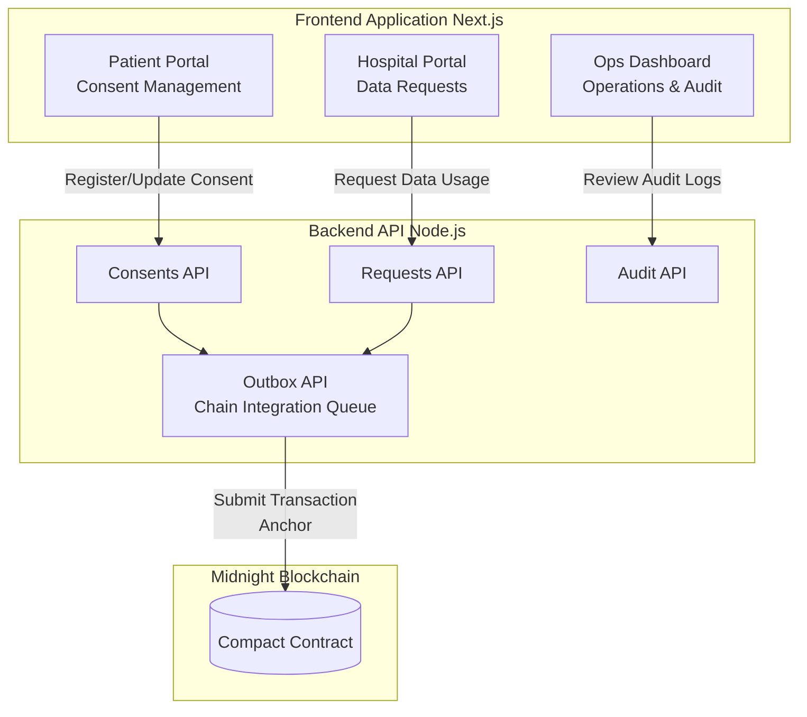
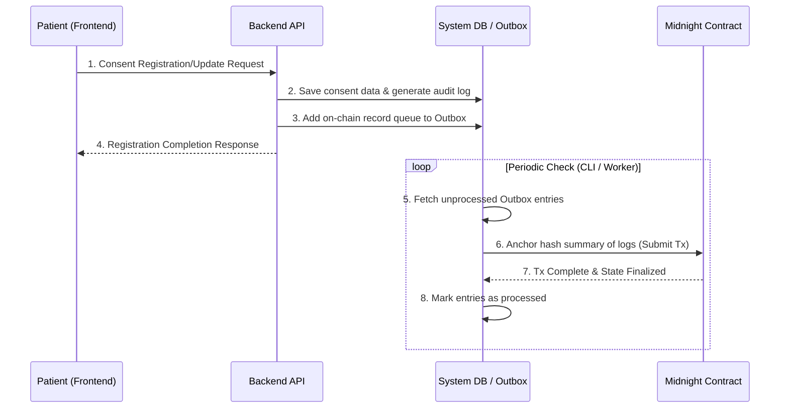

# CareTech Catalyst Hackathon

https://luma.com/w3ergmnd?tk=cyKVrM

## Overview
This project provides a secure and transparent platform for data sharing and usage auditing in the healthcare and caretech domains. By utilizing Compact smart contracts on the Midnight blockchain, it enables privacy-preserving yet verifiable data integration by anchoring patient consent information and hospital data access requests (Audit Traces) on-chain.

## System Architecture Diagram

## Feature List

| Feature Category | Target User | Description | Related Components |
|---|---|---|---|
| Consent Management | Patient | Manage consent status (grant/deny) for personal medical data usage based on purpose and recipient. | `frontend/app/patient` `backend/src/consents.ts` |
| Data Requests | Hospital | Request access to necessary patient data for research or clinical purposes and track the request status. | `frontend/app/hospital` `backend/src/requests.ts` |
| Audit & Ops | Auditor / Ops | Track and audit data access and consent modification histories across the platform. | `frontend/app/ops` `backend/src/audit.ts` |
| Blockchain Anchoring | System-wide | Record hash summaries of audit traces in batches (Anchor) to the Midnight network to generate tamper-proof evidence. | `backend/src/outbox.ts` `contract/src/counter.compact` |
| CLI Operations | Developer / Ops | Execute system maintenance and operational procedures, such as deployment, network verification, and local testing. | `cli/` |

## Sequence Diagrams

### Consent Registration and Blockchain Anchoring

## Tech Stack

| Area | Technology / Tools | Description |
|---|---|---|
| Frontend | **Next.js (App Router)** | UI construction and routing. Provides portals for Patient, Hospital, and Ops. |
| Frontend | **React** | Building declarative UI components. |
| Backend | **Node.js / TypeScript** | Persistent HTTP API. Responsible for managing domain logic, input validation, and persistence. |
| Smart Contract | **Compact** | Smart contract language operating on the Midnight blockchain. |
| Monorepo / Tooling | **pnpm Workspace** | Multi-package management for `frontend`, `backend`, `contract`, `cli`, `shared-infra`, etc. |
| Validation / Formatter | **Biome** | Fast repository-wide code formatting and linting. |
| Scripting & Operations | **ts-node / CLI scripts** | Automation for deployment, local testing, network connectivity, and operational flow verification. |

---
*Developed during the CareTech Catalyst Hackathon.*
