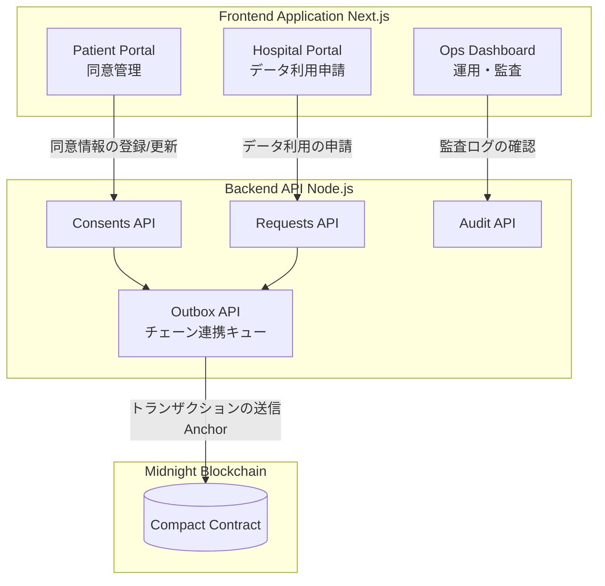
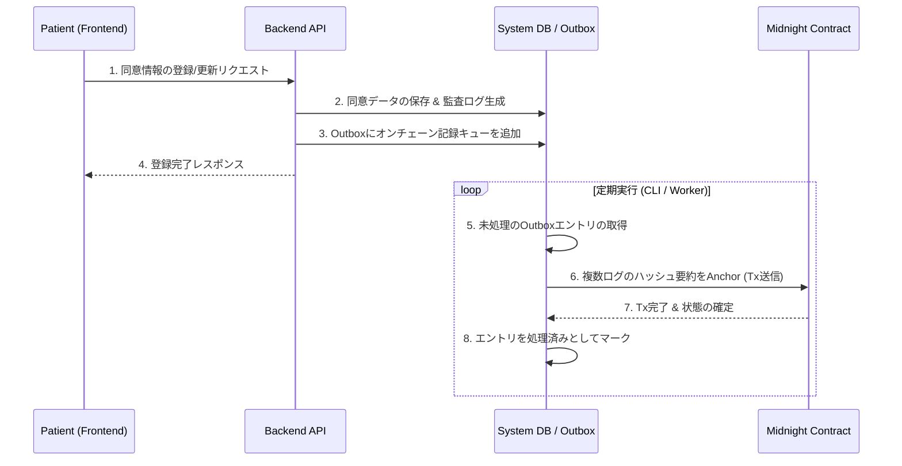

# CareTech Catalyst Hackathon

https://luma.com/w3ergmnd?tk=cyKVrM

## 概要 (Overview)
本プロジェクトは、医療・ケア領域におけるデータ共有と利用監査を安全かつ透明に行うためのプラットフォームです。Midnightブロックチェーン上のCompactスマートコントラクトを活用し、患者の同意情報や医療機関によるデータアクセス申請の監査証跡（Audit Traces）をオンチェーンに定着（Anchor）させることで、プライバシーを保護しつつ検証可能なデータ連携基盤を提供します。

## システム構成図 (System Architecture Diagram)

## 機能一覧表 (Feature List)

| 機能カテゴリ | ターゲットユーザー | 機能詳細 | 関連コンポーネント |
|---|---|---|---|
| 同意管理 (Consent Management) | 患者 (Patient) | 自身の医療データの利用目的や提供先ごとの同意状態（許諾/拒否）を管理する機能。 | `frontend/app/patient` `backend/src/consents.ts` |
| データ利用申請 (Data Requests) | 医療機関 (Hospital) | 研究や診療目的で必要な患者データの利用申請を行い、ステータスを追跡する機能。 | `frontend/app/hospital` `backend/src/requests.ts` |
| 監査・運用 (Audit & Ops) | 監査人・運用者 (Ops) | プラットフォーム上のデータアクセスや同意変更の履歴を追跡・監査する機能。 | `frontend/app/ops` `backend/src/audit.ts` |
| ブロックチェーン定着化 (Blockchain Anchoring) | システム共通 | 監査証跡のハッシュ値をMidnightネットワークに一括記録（Anchor）し、改ざん不能な証明を生成する機能。 | `backend/src/outbox.ts` `contract/src/counter.compact` |
| CLI運用ツール (CLI Operations) | 開発者・運用者 | デプロイ、ネットワーク検証、ローカルテストなどのシステム保守・運用手順を実行する機能。 | `cli/` |

## 処理ごとのシーケンス図 (Sequence Diagrams)

### 同意（Consent）登録とブロックチェーンへの定着化

## 技術スタック一覧表 (Tech Stack)

| 領域 | 技術・ツール | 説明 |
|---|---|---|
| Frontend | **Next.js (App Router)** | UIの構築、ルーティング。Patient / Hospital / Ops 用のポータルを提供。 |
| Frontend | **React** | 宣言的UIコンポーネントの構築。 |
| Backend | **Node.js / TypeScript** | 常駐HTTP API。ドメインロジックの調停、入力検証、永続化を担当。 |
| Smart Contract | **Compact** | Midnightブロックチェーン上で稼働するスマートコントラクト記述言語。 |
| Monorepo / Tooling | **pnpm Workspace** | `frontend`, `backend`, `contract`, `cli`, `shared-infra` などのマルチパッケージ管理。 |
| Validation / Formatter | **Biome** | リポジトリ全体のコードフォーマット、Lintの高速実行。 |
| Scripting & Operations | **ts-node / CLI scripts** | デプロイ、ローカルテスト、ネットワーク接続などの自動化および運用フローの検証用。 |

---
*Developed during the CareTech Catalyst Hackathon.*
